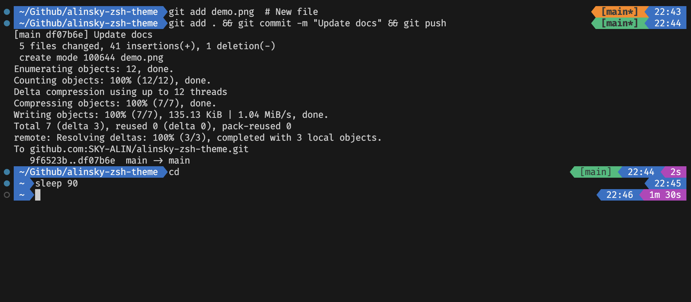

<link rel="stylesheet" href="https://cdnjs.cloudflare.com/ajax/libs/font-awesome/5.15.4/css/all.min.css">

# My daily theme for zsh shell



| Feature               | Description                                                                                  |
|-----------------------|----------------------------------------------------------------------------------------------|
| <i class="fab fa-git"></i> **Git** | Branch status with visual indicators for modified/untracked files                            |
| ⏱ **Performance**     | Execution time tracking (only >1s commands) in purple segment                                |
| <i class="fas fa-clock"></i> **Clock** | Context-aware timestamps:<br>- Prompt: render time<br>- Post-command: execution start time   |

## Installation:

Make sure you already installed [oh my zsh](https://ohmyz.sh/#install) and [git](https://git-scm.com/downloads), it's required for this theme.

If you use curl:

```shell
curl -sSf https://raw.githubusercontent.com/SKY-ALIN/zsh-theme/refs/heads/main/install.zsh | zsh
```

If you use wget:

```shell
wget -qO- https://raw.githubusercontent.com/SKY-ALIN/zsh-theme/refs/heads/main/install.zsh | zsh
```

Both commands will copy the theme code onto your machine, update .zshrc file and launch it. If you don't see the result, reboot your terminal.

---

The code is under the [GPL-3.0](https://github.com/SKY-ALIN/zsh-theme/blob/main/LICENSE) license. By using, modifying, or distributing this code, you agree to:  
- **Retain all original copyright notices**
- Disclose all source code of derivative works  
- Distribute modifications under the same license

Copyright (c) 2025 [Vladimir Alinsky](https://github.com/SKY-ALIN). 
